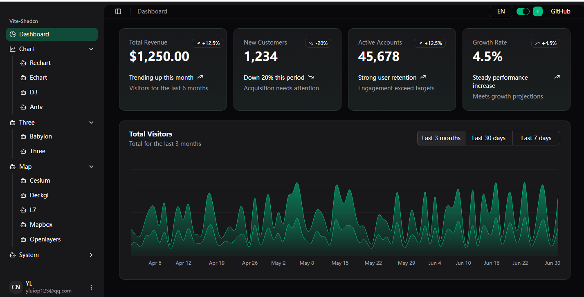
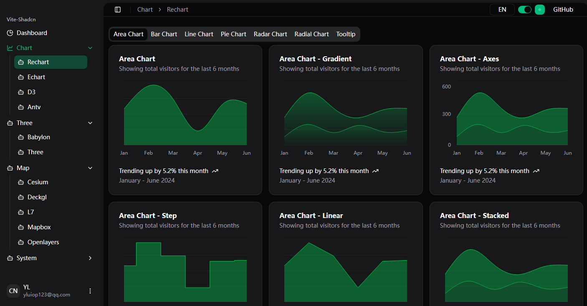

# vite-shadcn

VITE-SHADCN is a Shadcn Admin UI built with `Shadcn` , `Vite` , `React`,`Zustand`,`React-Router`

English | [简体中文](./README.zh-CN.md)





## 🚀 Quick Start

```bash
npm install
npm run dev
```

## ✅ Task List

- [x] Initialize the project
- [x] Set up environment: Vite + React + TypeScript + React Router + Zustand + Axios + MSW + ShadCN
- [x] Implement dynamic permission-based routing
- [x] Internationalization, theme color switching, and dark mode
- [ ] Multiple layouts
<details>
<summary>Login and Route Permission Control</summary>

  - [x] Login functionality
  - [x] Route access control
  - [x] Role switching (supports fusion mode)

</details>

<details>
<summary>Dashboard</summary>

  - [x] Basic dashboard
  - [ ] Situational Awareness - Cybersecurity
  - [ ] Situational Awareness - Military
  - [ ] Disaster Command
  - [ ] Agriculture and Forestry Management
  - [ ] Industrial Management

</details>

<details>
<summary>Component Library</summary>

  - [ ] General components
  - [ ] Form components (react-hook-form)
  - [ ] Table components (tanstack/react-table)
  - [ ] Custom components

</details>

<details>
<summary>Charts</summary>

  - [x] Recharts components
  - [x] ECharts components
  - [x] D3 components
  - [x] AntV components

</details>

<details>
<summary>3D</summary>

  - [x] Babylon  
  - [x] Three.js

</details>

<details>
<summary>Map</summary>

  - [x] Cesium  
  - [x] Deck.gl  
  - [x] L7  
  - [x] Leaflet 
  - [x] OpenLayers

</details>

<details>
<summary>System Management</summary>

  - [x] User Management  
  - [x] Role Management  
  - [x] Permission Management  
  - [x] Group Management  

</details>

<details>
<summary>Backend Plan</summary>

  - [ ] Develop backend APIs using Spring Boot  
  - [ ] Implement microservices

</details>


## 🛠️ command

| command | description             |
|---------|-------------------------|
| `dev` | `vite` |
| `build` | `tsc -b && vite build` |
| `build:github` | `tsc -b && vite build --mode github` |
| `lint` | `eslint .` |
| `preview` | `vite preview` |
| `preview:github` | `vite preview --mode github` |
| `analyze` | `cross-env ANALYZE=true vite build` |
| `readme` | `node ./readme/readme.js && node ./readme/readme-zh-CN.js` |

## 📦 dependencies

- dependencies:
  - @ant-design/charts: ^2.6.6
  - @antv/l7: ^2.23.1
  - @antv/larkmap: ^1.5.1
  - @babylonjs/core: ^8.42.0
  - @babylonjs/loaders: ^8.42.0
  - @dnd-kit/core: ^6.3.1
  - @dnd-kit/modifiers: ^9.0.0
  - @dnd-kit/sortable: ^10.0.0
  - @dnd-kit/utilities: ^3.2.2
  - @hookform/resolvers: ^5.0.1
  - @observablehq/plot: ^0.6.17
  - @radix-ui/react-avatar: ^1.1.9
  - @radix-ui/react-checkbox: ^1.3.1
  - @radix-ui/react-collapsible: ^1.1.11
  - @radix-ui/react-context-menu: ^2.2.16
  - @radix-ui/react-dialog: ^1.1.15
  - @radix-ui/react-dropdown-menu: ^2.1.15
  - @radix-ui/react-label: ^2.1.6
  - @radix-ui/react-navigation-menu: ^1.2.14
  - @radix-ui/react-popover: ^1.1.14
  - @radix-ui/react-radio-group: ^1.3.8
  - @radix-ui/react-scroll-area: ^1.2.10
  - @radix-ui/react-select: ^2.2.4
  - @radix-ui/react-separator: ^1.1.6
  - @radix-ui/react-slot: ^1.2.3
  - @radix-ui/react-switch: ^1.2.6
  - @radix-ui/react-tabs: ^1.1.12
  - @radix-ui/react-toggle: ^1.1.8
  - @radix-ui/react-toggle-group: ^1.1.9
  - @radix-ui/react-tooltip: ^1.2.7
  - @react-three/drei: ^10.7.7
  - @react-three/fiber: ^9.4.2
  - @tabler/icons-react: ^3.31.0
  - @tailwindcss/vite: ^4.1.3
  - @tanstack/react-table: ^8.21.3
  - axios: ^1.9.0
  - cesium: ^1.133.1
  - class-variance-authority: ^0.7.1
  - clsx: ^2.1.1
  - cmdk: ^1.1.1
  - colorjs.io: ^0.5.2
  - deck.gl: ^9.2.5
  - echarts-for-react: ^3.0.2
  - leaflet: ^1.9.4
  - leva: ^0.10.1
  - lucide-react: ^0.488.0
  - next-themes: ^0.4.6
  - ol: ^10.7.0
  - react: ^19.1.0
  - react-arborist: ^3.4.3
  - react-dom: ^19.1.0
  - react-hook-form: ^7.56.3
  - react-icons: ^5.5.0
  - react-intl: ^7.1.11
  - react-leaflet: ^5.0.0-rc.2
  - react-map-gl: ^8.1.0
  - react-openlayers: ^10.5.1
  - react-resizable-panels: ^3.0.6
  - react-router: ^7.6.2
  - recharts: ^2.15.3
  - resium: ^1.19.0-beta.1
  - sonner: ^2.0.5
  - tailwind-merge: ^3.2.0
  - tailwindcss: ^4.1.3
  - tailwindcss-animate: ^1.0.7
  - three: ^0.182.0
  - vaul: ^1.1.2
  - zod: ^3.24.4
  - zustand: ^5.0.5

- devDependencies:
  - @eslint/js: ^9.24.0
  - @types/leaflet: ^1.9.21
  - @types/loadable__component: ^5.13.9
  - @types/mockjs: ^1.0.10
  - @types/node: ^22.14.1
  - @types/react: ^19.1.1
  - @types/react-dom: ^19.1.2
  - @vitejs/plugin-react-swc: ^3.8.1
  - cross-env: ^7.0.3
  - eslint: ^9.24.0
  - eslint-plugin-react-hooks: ^5.2.0
  - eslint-plugin-react-refresh: ^0.4.19
  - globals: ^16.0.0
  - msw: ^2.10.2
  - rollup-plugin-visualizer: ^6.0.3
  - typescript: ~5.8.3
  - typescript-eslint: ^8.29.1
  - vite: ^6.2.6
  - vite-plugin-cesium-build: ^0.7.1

## 🧾 License

This project is [MIT licensed](./LICENSE).
