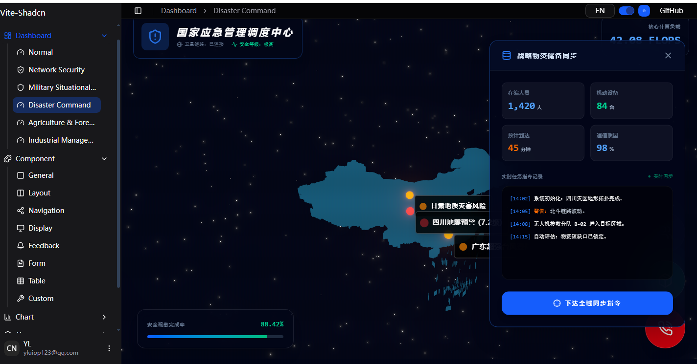
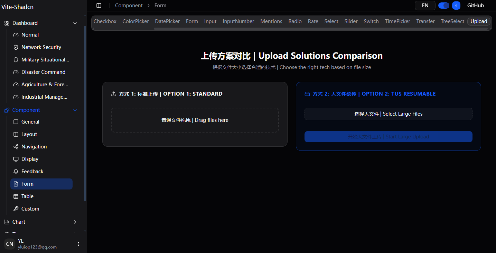

# vite-shadcn

VITE-SHADCN is a Shadcn Admin UI built with `Shadcn` , `Vite` , `React`,`Zustand`,`React-Router`
Branch Description: main branch is based on base-ui, radix-ui branch is based on radix-ui.


English | [简体中文](./README.zh-CN.md)






## Quick Start

### 1) Environment

- **Node.js**: v18+  
- **pnpm**: v10.28.2  

---

### 2) Tech Stack

- **Framework**: React 19 + Vite 6  
- **State Management**: Zustand  
- **UI Library**: ShadCN + TailwindCSS  
- **Internationalization**: react-intl  
- **Routing**: React Router v7  
- **Mock API**: Mock Service Worker (MSW)  
- **Build Tool**: Vite 6  

---

### 3) Installation & Run

```bash
# Clone repository
git clone https://github.com/yluiop123/vite-shadcn.git
cd <project-directory>

# Install dependencies
pnpm install

# Start development server
pnpm dev

# Visit http://localhost:3000/
```
### 4）CLI Commands

| Command        | Description                        | Notes                                |
| -------------- | ---------------------------------- | ------------------------------------ |
| dev            | vite                               | Start dev server with hot reload     |
| build          | tsc -b && vite build               | Type check then build for production |
| build:github   | tsc -b && vite build --mode github | Build for GitHub Pages               |
| lint           | eslint .                           | Run ESLint checks                    |
| preview        | vite preview                       | Preview production build             |
| preview:github | vite preview --mode github         | Preview GitHub Pages build           |
| analyze        | cross-env ANALYZE=true vite build  | Bundle size analysis                 |


### 5）Environment Variables

The project uses .env files for environment configuration.
When using --mode, Vite will automatically load the corresponding .env.[mode] file.

Common environment variables:

```env
VITE_BASE=/              # Base path for deployment
VITE_ROUTE=browserRouter # Routing strategy
VITE_MOCK_ENABLE=true    # Enable mock services
VITE_BASE_API=/api/      # API base prefix
VITE_CESIUM_TOKEN=###    # Cesium service access token

```

## Project Structure

```
vite-shadcn
├── .github/                     # GitHub Settings File
│   ├── workflows/
│   │   └── main.yml            # CI/CD Workflow Configuration
│   ├── copilot-instructions.md  # Copilot Instructions
├── .trae/                       # Trae IDE Rules
│   └── rules/
├── public/                      # Static Resource Directory
├── src/                         # Source Code Directory
│   ├── assets/                  # Static Resource Directory
│   ├── components/              # General Components
│   │   ├── ext/                 # Extended Components
│   │   ├── ui/                  # Shadcn UI Base Components
│   │   ├── app-sidebar.tsx      # Application Sidebar
│   │   ├── chart-area-interactive.tsx # Interactive Area Chart
│   │   ├── color-switcher.tsx   # Color Switcher
│   │   ├── dialog-form.tsx      # Form Dialog
│   │   ├── group-tree-select.tsx # Group Tree Selector
│   │   ├── nav-main.tsx         # Main Navigation
│   │   ├── nav-user.tsx         # User Navigation
│   │   ├── permission-tree-select.tsx # Permission Tree Selector
│   │   ├── permission-tree-single-select.tsx # Permission Single Tree Selector
│   │   ├── permission-type.tsx  # Permission Type
│   │   ├── role-select.tsx      # Role Selector
│   │   ├── section-cards.tsx    # Section Cards
│   │   ├── sidebar-menutree.tsx # Sidebar Menu Tree
│   │   ├── site-header.tsx      # Site Header
│   │   └── ...                  # More Components
│   ├── hooks/                   # React Hooks
│   │   └── use-mobile.ts        # Mobile Detection Hook
│   ├── lib/                     # Utility Library
│   │   ├── axios.ts             # Axios Configuration
│   │   ├── dict.ts              # Dictionary Utilities
│   │   ├── fixLeafletIcon.ts    # Leaflet Icon Fixer
│   │   ├── notify.ts            # Notification Utilities
│   │   └── utils.ts             # General Utility Functions
│   ├── locale/                  # Internationalization
│   │   ├── en-US.ts             # English Translation
│   │   └── zh-CN.ts             # Chinese Translation
│   ├── mock/                    # Mock Data
│   ├── pages/                   # Page Components
│   │   ├── chart/               # Chart Pages
│   │   ├── component/           # Component Examples
│   │   ├── dashboard/           # Dashboard Pages
│   │   ├── system/              # System Management Pages
│   ├── store/                   # State Management
│   ├── themes/                  # Theme Color Files
│   ├── App.tsx                  # Application Root Component
│   ├── index.css                # Global Styles
│   ├── layout.tsx               # Application Layout
│   └── main.tsx                 # Application Entry Point
├── .env                         # Environment Variables
├── .env.github                  # GitHub Environment Variables
├── .gitignore                   # Git Ignore File
├── .hintrc                      # Webhint Configuration File
├── CODE_OF_CONDUCT.md           # Code of Conduct
├── LICENSE                      # License
├── components.json              # Component Configuration
└── package.json                 # Project Configuration
```

---

## Routing & Menu

### Route Example (React Router v7)

```ts
//src\routes.ts
const routeSetting: NavItem[] = [
  {
    key: "dashboard",
    title: "menu.dashboard",
    icon: LayoutDashboard,
    children: [
      { key: "normal", title: "menu.dashboard.normal", icon: Gauge },
    ],
  },
];
```

The route configuration contains four core parameters：

- **key**: The route path identifier, used to uniquely identify a navigation target
- **title**: The internationalization key value, used for multi-language text mapping
- **icon**: The menu icon element, used for visual identification
- **children**: The child menu array, used to build nested navigation structures

### Example Configuration for a Page

1. Configure the route dashboard\normal

```ts
//src\routes.ts
const routeSetting: NavItem[] = [
  {
    key: "dashboard",
    title: "menu.dashboard",
    icon: LayoutDashboard,
    children: [
      { key: "normal", title: "menu.dashboard.normal", icon: Gauge },
    ],
  },
];
```

2. Configure the title key in the internationalization file

```ts
//src\locale\en-US.ts
export default {
    'menu.dashboard': 'Dashboard',
    'menu.dashboard.normal': 'Normal',
};
```

```ts
//src\locale\zh-CN.ts
export default {
    'menu.dashboard': '仪表盘',
    'menu.dashboard.normal': '普通仪表盘',
};
```

3. Add the page component

src\pages\component\general\index.tsx

Note: The page component must be placed in the `index.tsx` file.

4. Mock Permission Addition

The following code simulates fetching the current user's permissions. You need to add the permission for the new menu in this code.

```ts
//src\mock\system\permission.ts
    http.get<{ id: string }>(
    "/api/system/permissions/detail/:id",
```

Corresponding function is getPermissionList

```ts
//src\mock\system\permission.ts
function getPermissionList(locale: string) {
    const dataArray: Permission[] = [
            //supper menu permissions
            {id: '0000', parentId:'',order: 0, path: "/dashboard",type: "directory",name:localeMap[locale]['menu.dashboard'] },
            {id: '0001', parentId:'',order: 1, path: "/component", type: "menu",name:localeMap[locale]['menu.component'] },
            {id: '000100', parentId:'0001',order: 0, path: "/component/general", type: "menu",name:localeMap[locale]['menu.component.general'] },
```

`component/general` page corresponds to the permission identifier `id: '000100'`, where the `type` field represents the permission type:

- **directory**: Directory permission, which includes access permissions for all sub-menus in the directory
- **menu**: Menu item permission, which only controls access permissions for the current menu item

## Internationalization

### Configuration Example (react-intl)：

```ts
//src\locale\en-US.ts
export default {
    'menu.dashboard': 'Dashboard',
};
```

```ts
//src\locale\zh-CN.ts
export default {
    'menu.dashboard': '仪表盘',
};
```

### Page Usage Example：

```ts
import { useIntl } from "react-intl";

const { formatMessage } = useIntl();
<div>{formatMessage({ id: "menu.dashboard", defaultMessage: "Dashboard" })}</div>
```

---

## Mock Data

The project uses MSW to simulate data. The code for importing MSW is as follows:

```ts
//src\main.tsx
const mockEnable = (import.meta.env.VITE_MOCK_ENABLE||'true')=='true';
if(mockEnable){
  initMSW().then(()=>{
    createRootElement();
  })
}else{
  createRootElement();
}
```

Mock data entry is in the following file. If you want to add new mock data, refer to the following code to add a new handler.

```ts
//src\mock\index.ts
import { setupWorker } from "msw/browser";
import groupHandlers from "./components/group";
import permissionHandlers from "./components/permission";
import loginUserHandlers from "./login/user";
import systemGroupHandlers from "./system/group";
import systemPermissionHandlers from "./system/permission";
import systemRoleHandlers from "./system/role";
import systemUserHandlers from "./system/user";
const mockHandlers = [
  ...loginUserHandlers,
  ...groupHandlers,
  ...permissionHandlers,
  ...systemUserHandlers,
  ...systemRoleHandlers,
  ...systemGroupHandlers,
  ...systemPermissionHandlers
];
let worker: ReturnType<typeof setupWorker> | null = null;
export default async function initMSW() {
  if (worker) return worker;
  worker = setupWorker(...mockHandlers);
  await worker.start({

    serviceWorker: {
      url: `${import.meta.env.BASE_URL}mockServiceWorker.js`,
      options: { type: 'module', updateViaCache: 'none' },
    },
    onUnhandledRequest: (req) => {
      if (!req.url.startsWith('/api')) {
        return 
      }
    },
  });
  return worker;
}
```
---
## Permission Control

User permissions are obtained from userInfo.

```ts
import { useUserStore } from '@/store';
const { userInfo} = useUserStore();
```
System Permission Management Includes the Following Concepts：
- **rolePermissions**:A set of role permissions that define the specific permissions assigned to a role.
- **userPermissions**:  A set of user permissions that define the permissions at the user account level.
- **currentPermission**: The currently effective permission, which is the union of user permissions and the selected role permissions.
- **currentMenuPermission**: The current menu permission, used to control the display of specific menu items.
- **currentDirectoryPermission**: The current directory permission, used to control the visibility of directory nodes. Having directory permission automatically grants all child menu permissions under it.

The system supports multi-role management mode. When a user selects "All Roles," the system integrates the union of user permissions and all role permissions as the current permission set, enabling flexible permission control strategies.

Backend permission fields
```ts
//src\mock\components\permission.ts
type Permission = {
  name: string // Permission name, used for display in menus or permission lists
  id: string // Permission ID, used to uniquely identify the permission
  path: string // Permission path, used to identify specific resources or operations
  type: string // Permission type, indicating the specific role of the permission (such as directory: directory, menu: menu, action: action, function: function, api: api)
  action?: string // Only exists when type=action, operation name, further refining the specific operation of the permission (such as read, write, execute, etc.)
  status?: "0" | "1" // Permission status, 0 means disabled, 1 means enabled
  create?: string, // Creation time, records the time when the permission was created
  parentId?: string // Parent permission ID, used to build the permission tree structure
  order: number // Sorting order, used for sorting display in menus or permission lists, automatically generated by the backend
}
```
Frontend permission fields
```ts
//src\store\user.ts
type Permission = {
  path: string; // Permission path, used to identify specific resources or operations
  role: string; // Role name, specifies the role to which the permission belongs
  type: string;
  // Permission type, indicating the specific role of the permission (such as directory: directory, menu: menu, action: action, function: function, api: api)
  /**
   * Permission type, indicating the specific role of the permission (such as directory: directory, menu: menu, action: action, function: function, api: api)
   * - directory: Directory permission, includes access permissions for all sub-menus under the directory
   * - menu: Menu item permission, only controls access permissions for the current menu item
   * - action: Represents specific actions under a menu (such as read, write, execute, etc.)
   * - function: Function permission, used to execute specific system functions
   * - api: API permission, used to access API interfaces provided by the backend
   */
  action: string; // Operation name, further refining the specific operation of the permission (such as read, write, execute, etc.)
};
```
## Theme

1.Add a new theme color under src/themes.
2.After adding the new theme color, it needs to be imported.

```ts
//src\index.css
@import "@/themes/blue.css";
@import "@/themes/green.css";
@import "@/themes/orange.css";
@import "@/themes/red.css";
@import "@/themes/rose.css";
@import "@/themes/violet.css";
@import "@/themes/yellow.css";
```

- **Theme Color Switching**: Users can switch between different theme colors to personalize the visual experience.

Below is an example of configuring theme colors. The string color values should match those in the src\themes directory.

```ts
//src\store\theme.ts
export type Color =
  | "default"
  | "blue"
  | "green"
  | "orange"
  | "red"
  | "rose"
  | "violet"
  | "yellow";
```

```ts
import {useThemeStore } from '@/store/index';
const {color,setColor} = useThemeStore();
setColor('blue')
```


## 🧾 License

This project is [MIT licensed](./LICENSE).
