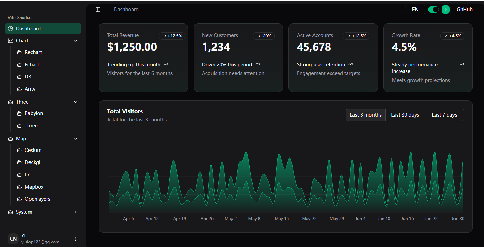
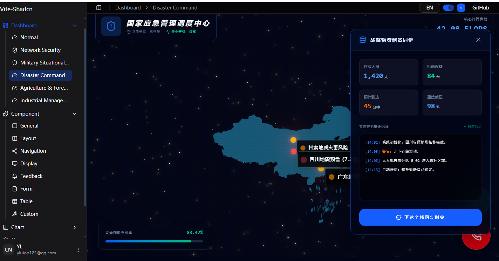
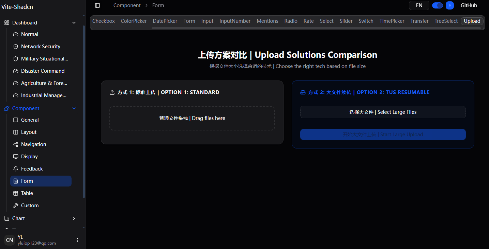
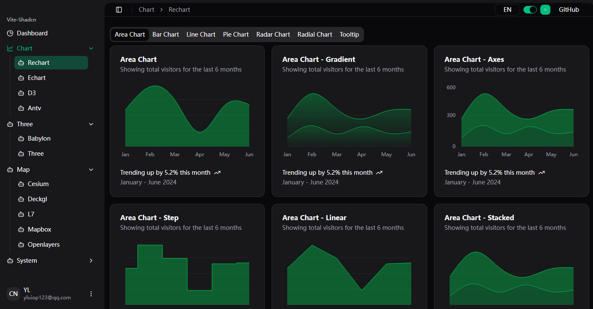

# vite-shadcn

VITE-SHADCN is a Shadcn Admin UI built with `Shadcn` , `Vite` , `React`,`Zustand`,`React-Router`

Project URL: https://yluiop123.github.io/vite-shadcn
Swagger URL: https://yluiop123.github.io/vite-shadcn/#/swagger

English | [简体中文](./README.zh-CN.md)

## Directory Structure

### 1) vite-shadcn

- **Framework**: React 19 + Vite 6  
- **State Management**: Zustand  
- **UI Library**: ShadCN + TailwindCSS  
- **Internationalization**: react-intl  
- **Routing**: React Router v7  
- **Mock API**: Mock Service Worker (MSW)  
- **Build Tool**: Vite 6  

[Frontend README](./vite-shadcn/README.md)

---

### 2) database
This folder contains database-related DDL and DDM scripts.
Folder type is the database type, such as postgres, mysql, etc. 

---
### 3) springboot

- **Backend**: Spring Boot 4.0.2  
- **Java Version**: 25  
- **Database**: PostgreSQL  
- **Security**: Spring Security + JWT  
- **API Documentation**: SpringDoc OpenAPI 3.0  
- **Caching**: Caffeine  
- **ORM**: Spring Data JPA  
- **Build Tool**: Maven  
- **Development Tool**: Lombok  

[springboot Backend README](./springboot/README.md)

## 🧾 License

This project is [MIT licensed](./LICENSE).
