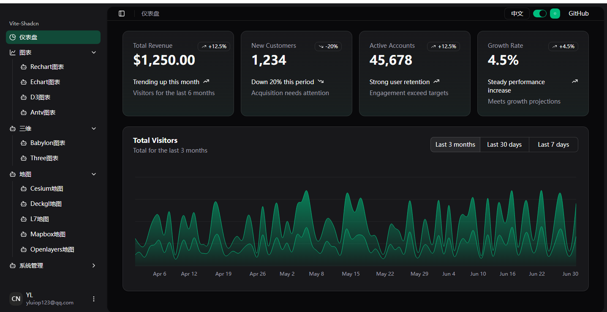
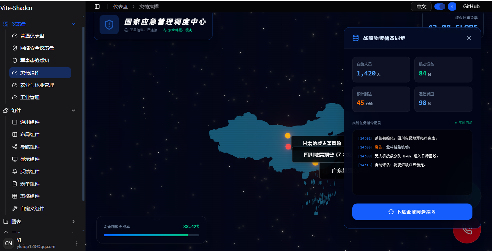

# vite-shadcn

VITE-SHADCN 是一个基于 `Shadcn` , `Vite` , `React`,`Zustand`,`React-Router` 等构建的SHADCN ADMIN UI 。
分支说明：main 分支为基于base-ui，radix-ui 基于radix-ui。

[English](./README.md) | 简体中文





## 快速开始

### 1）环境

- **Node.js**: v18+
- **pnpm**: pnpm v10.28.2

### 2）技术栈

- **框架**: React 19 + Vite6
- **状态管理**: Zustand
- **UI 组件库**: ShadCN + TailwindCSS
- **国际化**: react-intl
- **路由**: React Router v7
- **接口模拟**: Mock Service Worker (MSW)
- **构建工具**: Vite6

### 3）安装启动

```bash
# 克隆项目
git clone https://github.com/yluiop123/vite-shadcn.git
cd <项目目录>

# 安装依赖
pnpm install   

# 本地开发启动
pnpm dev    

#项目启动后访问 http://localhost:3000/   
```

### 4）命令行

| 命令  | 描述  | 说明  |
| --- | --- | --- |
| dev | vite | 启动开发服务器，支持热重载和实时编译 |
| build | tsc -b && vite build | 构建生产版本，先进行 TypeScript 类型检查，再打包项目 |
| build:github | tsc -b && vite build --mode github | 构建 GitHub 部署版本，使用特定的构建配置 |
| lint | eslint . | 运行 ESLint 检查代码质量，识别潜在问题 |
| preview | vite preview | 预览生产构建的项目，用于本地测试构建结果 |
| preview:github | vite preview --mode github | 预览 GitHub 部署版本的构建结果 |
| analyze | cross-env ANALYZE=true vite build | 分析打包结果，生成 bundle 分析报告 |

### 5）环境变量

项目默认使用 `.env` 文件作为环境变量配置。当通过 `--mode` 参数指定特定模式时，Vite 会自动加载对应的环境变量文件。例如，`build:github` 命令会加载 `.env.github` 文件中的配置。

以下是常用的环境变量配置及其说明：

```
VITE_BASE=/              # 项目部署的相对路径，用于指定应用的基础 URL
VITE_ROUTE=browserRouter # 路由类型，决定应用使用的路由策略
VITE_MOCK_ENABLE=true    # 是否启用 Mock 数据服务，用于开发和测试
VITE_BASE_API=/api/      # API 请求的统一前缀，用于后端接口调用
VITE_CESIUM_TOKEN=###    # Cesium 地图服务的认证令牌
```

## 目录结构

```
vite-shadcn
├── .github/                     # GitHub 配置文件
│   ├── workflows/
│   │   └── main.yml            # CI/CD 工作流配置
│   ├── copilot-instructions.md  # Copilot 指令
├── .trae/                       # Trae IDE 规则
│   └── rules/
├── public/                      # 静态资源目录
├── src/                         # 源代码目录
│   ├── assets/                  # 静态资源
│   ├── components/              # 通用组件
│   │   ├── ext/                 # 扩展组件
│   │   ├── ui/                  # Shadcn UI 基础组件
│   │   ├── app-sidebar.tsx      # 应用侧边栏
│   │   ├── chart-area-interactive.tsx # 交互式面积图
│   │   ├── color-switcher.tsx   # 颜色切换器
│   │   ├── dialog-form.tsx      # 表单对话框
│   │   ├── group-tree-select.tsx # 分组树选择器
│   │   ├── nav-main.tsx         # 主导航
│   │   ├── nav-user.tsx         # 用户导航
│   │   ├── permission-tree-select.tsx # 权限树选择器
│   │   ├── permission-tree-single-select.tsx # 权限单选树
│   │   ├── permission-type.tsx  # 权限类型
│   │   ├── role-select.tsx      # 角色选择器
│   │   ├── section-cards.tsx    # 区域卡片
│   │   ├── sidebar-menutree.tsx # 侧边栏菜单树
│   │   ├── site-header.tsx      # 站点头部
│   │   └── ...                  # 更多组件
│   ├── hooks/                   # React Hooks
│   │   └── use-mobile.ts        # 移动端检测 Hook
│   ├── lib/                     # 工具库
│   │   ├── axios.ts             # Axios 配置
│   │   ├── dict.ts              # 字典工具
│   │   ├── fixLeafletIcon.ts    # Leaflet 图标修复
│   │   ├── notify.ts            # 通知工具
│   │   └── utils.ts             # 通用工具函数
│   ├── locale/                  # 国际化
│   │   ├── en-US.ts             # 英文翻译
│   │   └── zh-CN.ts             # 中文翻译
│   ├── mock/                    # Mock 数据
│   ├── pages/                   # 页面组件
│   │   ├── chart/               # 图表页面
│   │   ├── component/           # 组件示例页面
│   │   ├── dashboard/           # 仪表板页面
│   │   ├── system/              # 系统管理页面
│   ├── store/                   # 状态管理
│   ├── themes/                  # 主题色文件
│   ├── App.tsx                  # 应用根组件
│   ├── index.css                # 全局样式
│   ├── layout.tsx               # 应用布局
│   └── main.tsx                 # 应用入口
├── .env                         # 环境变量
├── .env.github                  # GitHub 环境变量
├── .gitignore                   # Git 忽略文件
├── .hintrc                      # Webhint 配置
├── CODE_OF_CONDUCT.md           # 行为准则
├── LICENSE                      # 许可证
├── components.json              # 组件配置
└── package.json                 # 项目配置
```

---

## 路由与菜单

### 路由示例（React Router v7）：

```ts
//src\routes.ts
const routeSetting: NavItem[] = [
  {
    key: "dashboard",
    title: "menu.dashboard",
    icon: LayoutDashboard,
    children: [
      { key: "normal", title: "menu.dashboard.normal", icon: Gauge },
    ],
  },
];
```

路由配置包含四个核心参数：

- **key**: 路由路径标识符，用于唯一确定导航目标
- **title**: 国际化配置键值，用于多语言文本映射
- **icon**: 菜单图标元素，用于视觉标识
- **children**: 子菜单数组，用于构建嵌套导航结构

### 如下，是其中一个页面的配置示例：

1. 配置路由dashboard\normal

```ts
//src\routes.ts
const routeSetting: NavItem[] = [
  {
    key: "dashboard",
    title: "menu.dashboard",
    icon: LayoutDashboard,
    children: [
      { key: "normal", title: "menu.dashboard.normal", icon: Gauge },
    ],
  },
];
``

2.国际化文件中配置title中的key

```ts
//src\locale\en-US.ts
export default {
    'menu.dashboard': 'Dashboard',
    'menu.dashboard.normal': 'Normal',
};
```

```ts
//src\locale\zh-CN.ts
export default {
    'menu.dashboard': '仪表盘',
    'menu.dashboard.normal': '普通仪表盘',
};
```

3.增加页面

src\pages\component\general\index.tsx

注意必须在index.tsx下。

4.mock权限增加

下面这段模拟的是获取当前用户权限，需要在这段代码里增加新增菜单的权限。

```ts
//src\mock\system\permission.ts
    http.get<{ id: string }>(
    "/api/system/permissions/detail/:id",
```

对应的function 是getPermissionList

```ts
//src\mock\system\permission.ts
function getPermissionList(locale: string) {
    const dataArray: Permission[] = [
            //supper menu permissions
            {id: '0000', parentId:'',order: 0, path: "/dashboard",type: "directory",name:localeMap[locale]['menu.dashboard'] },
            {id: '0001', parentId:'',order: 1, path: "/component", type: "menu",name:localeMap[locale]['menu.component'] },
            {id: '000100', parentId:'0001',order: 0, path: "/component/general", type: "menu",name:localeMap[locale]['menu.component.general'] },
```

`component/general` 页面对应的权限标识为 `id: '000100'`，其中 `type` 字段表示权限类型：

- **directory**: 目录权限，包含该目录下所有子菜单的访问权限
- **menu**: 菜单项权限，仅控制当前菜单项的访问权限

## 国际化

### 配置示例（react-intl）：

```ts
//src\locale\en-US.ts
export default {
    'menu.dashboard': 'Dashboard',
};
```

```ts
//src\locale\zh-CN.ts
export default {
    'menu.dashboard': '仪表盘',
};
```

### 页面使用示例：

```ts
import { useIntl } from "react-intl";

const { formatMessage } = useIntl();
<div>{formatMessage({ id: "menu.dashboard", defaultMessage: "Dashboard" })}</div>
```

---

## 模拟数据

项目使用 MSW 模拟数据，msw的引入代码如下

```ts
//src\main.tsx
const mockEnable = (import.meta.env.VITE_MOCK_ENABLE||'true')=='true';
if(mockEnable){
  initMSW().then(()=>{
    createRootElement();
  })
}else{
  createRootElement();
}
```

mock数据的入口在如下文件，如果要新增mock的话，参照如下代码新增一个handlers就行了

```ts
//src\mock\index.ts
import { setupWorker } from "msw/browser";
import groupHandlers from "./components/group";
import permissionHandlers from "./components/permission";
import loginUserHandlers from "./login/user";
import systemGroupHandlers from "./system/group";
import systemPermissionHandlers from "./system/permission";
import systemRoleHandlers from "./system/role";
import systemUserHandlers from "./system/user";
const mockHandlers = [
  ...loginUserHandlers,
  ...groupHandlers,
  ...permissionHandlers,
  ...systemUserHandlers,
  ...systemRoleHandlers,
  ...systemGroupHandlers,
  ...systemPermissionHandlers
];
let worker: ReturnType<typeof setupWorker> | null = null;
export default async function initMSW() {
  if (worker) return worker;
  worker = setupWorker(...mockHandlers);
  // 启动 MSW
  await worker.start({

    serviceWorker: {
      url: `${import.meta.env.BASE_URL}mockServiceWorker.js`,
      options: { type: 'module', updateViaCache: 'none' },
    },
    onUnhandledRequest: (req) => {
      if (!req.url.startsWith('/api')) {
        return // 直接跳过，不拦截
      }
    },
  });
  return worker;
}
```

## 权限控制

用户权限从userInfo中获取

```ts
import { useUserStore } from '@/store';
const { userInfo} = useUserStore();
```

系统权限管理包含以下概念：

- **rolePermissions**: 角色权限集合，定义特定角色所拥有的权限
- **userPermissions**: 用户权限集合，定义用户账户级别的权限
- **currentPermission**: 当前生效权限，为用户权限与所选角色权限的并集
- **currentMenuPermission**: 当前菜单权限，用于控制具体菜单项的显示
- **currentDirectoryPermission**: 当前目录权限，用于控制目录节点的显示，拥有目录权限时自动获得其下所有子菜单权限

系统支持多角色管理模式。当用户选择"全部角色"时，系统将整合用户权限与所有角色权限的并集作为当前权限集，实现灵活的权限控制策略。

后端返回的权限字段
```ts
//src\mock\components\permission.ts
type Permission = {
  name: string//权限名称，用于显示在菜单或权限列表中
  id: string//权限ID，用于唯一标识权限
  path: string//权限路径，用于标识具体的资源或操作
  type: string//权限类型，指示权限的具体作用（如目录：directory、菜单：menu、操作：action、功能：function、接口：api）
  action?: string//type=action时才会有，操作名称，进一步细化权限的具体操作（如读取、写入、执行等）
  status?: "0" | "1"//权限状态，0表示禁用，1表示启用
  create?: string,//创建时间，记录权限创建的时间
  parentId?: string//父权限ID，用于构建权限树结构
  order: number//排序顺序，用于在菜单或权限列表中排序显示，后端自动生成
}
```
前端权限字段
```ts
//src\store\user.ts
type Permission = {
  path: string;//权限路径，用于标识具体的资源或操作
  role: string;//角色名称，指定该权限所属的角色
  type: string;
  //权限类型，指示权限的具体作用（如目录：directory、菜单：menu、操作：action、功能：function、接口：api）
  /**
   * 权限类型，指示权限的具体作用（如目录：directory、菜单：menu、操作：action、功能：function、接口：api）
   * - directory: 目录权限，包含该目录下所有子菜单的访问权限
   * - menu: 菜单项权限，仅控制当前菜单项的访问权限
   * - action: 表示菜单下的具体动作（如读取、写入、执行等）
   * - function: 功能权限，用于执行特定的系统功能
   * - api: 接口权限，用于访问后端提供的API接口
   */
  action: string;//操作名称，进一步细化权限的具体操作（如读取、写入、执行等）
};
```

## 主题

1.新增主题色在src\themes下

2.新增主题色后，需要导入

```ts
//src\index.css
@import "@/themes/blue.css";
@import "@/themes/green.css";
@import "@/themes/orange.css";
@import "@/themes/red.css";
@import "@/themes/rose.css";
@import "@/themes/violet.css";
@import "@/themes/yellow.css";
```

- 主题色切换

下面可以配置主题色，Color的字符串颜色和src\themes中的一致

```ts
//src\store\theme.ts
export type Color =
  | "default"
  | "blue"
  | "green"
  | "orange"
  | "red"
  | "rose"
  | "violet"
  | "yellow";
```

```ts
import {useThemeStore } from '@/store/index';
const {color,setColor} = useThemeStore();
setColor('blue')
```


## 🧾 License

[MIT 协议](./LICENSE)
