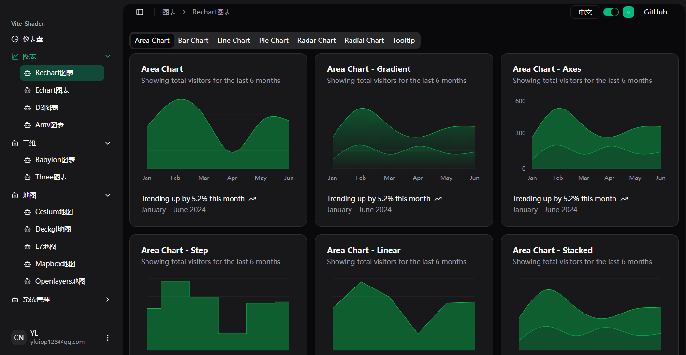

# vite-shadcn

VITE-SHADCN 是一个基于 `Shadcn` , `Vite` , `React`,`Zustand`,`React-Router` 等构建的SHADCN ADMIN UI 。
项目访问地址： https://yluiop123.github.io/vite-shadcn
swagger 地址： https://yluiop123.github.io/vite-shadcn/#/swagger
[English](./README.md) | 简体中文

## 目录结构

### 1）vite-shadcn

- **框架**: React 19 + Vite6
- **状态管理**: Zustand
- **UI 组件库**: ShadCN + TailwindCSS
- **国际化**: react-intl
- **路由**: React Router v7
- **接口模拟**: Mock Service Worker (MSW)
- **构建工具**: Vite6

[vite-shadcn README](./vite-shadcn/README.zh-CN.md)

---

### 2）database
    此文件夹包含数据库相关DDL、DDM脚本。
    文件夹类型即为数据库类型，如postgres、mysql等。
    
---
### 3）springboot

- **后端框架**: Spring Boot 4.0.2
- **Java版本**: 25
- **数据库**: PostgreSQL
- **安全框架**: Spring Security + JWT
- **API文档**: SpringDoc OpenAPI 3.0
- **缓存**: Caffeine
- **ORM**: Spring Data JPA
- **构建工具**: Maven
- **开发工具**: Lombok

[springboot README](./springboot/README.zh-CN.md)

## 🧾 License

[MIT 协议](./LICENSE)
